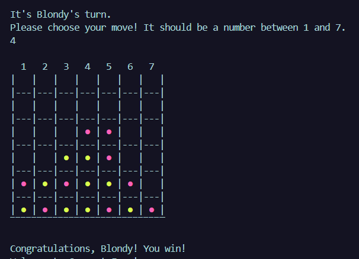

# Connect Four Game 🎲

Connect Four is a classic two-player game in which players take turns dropping colored discs from the top into a vertically suspended grid. The objective of the game is to connect four of one's own discs of the same color next to each other vertically, horizontally, or diagonally before the opponent.

This implementation of Connect Four is developed in Ruby using Test-Driven Development (TDD) with RSpec.

## Features ✨

- Interactive gameplay allowing two players to take turns.
- Board display to visualize the game state.
- Validation of player moves to ensure they are within the valid range and the chosen column is not full.
- Detection of winning combinations to determine the winner.

## Usage 🚀
- If you clone the repository:
    -   To start the game, run the following command:
        ```bash
        ruby main.rb
        ```
- [Replit](https://replit.com/@blondymartinezm/Ruby-TDD-ConnectFour)
    - Fork & Run

Follow the on-screen instructions to play the game. Enter a number between 1 and 7 to choose your move.

## Tests 🧪
This project uses RSpec for testing. To run the tests, execute the following command:

```bash
rspec
```

## Screenshot 📷

